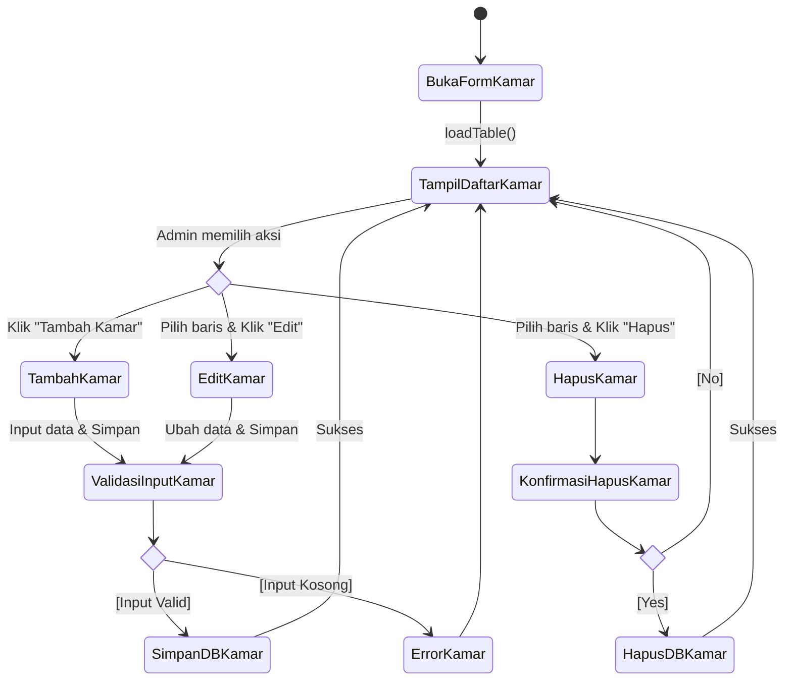
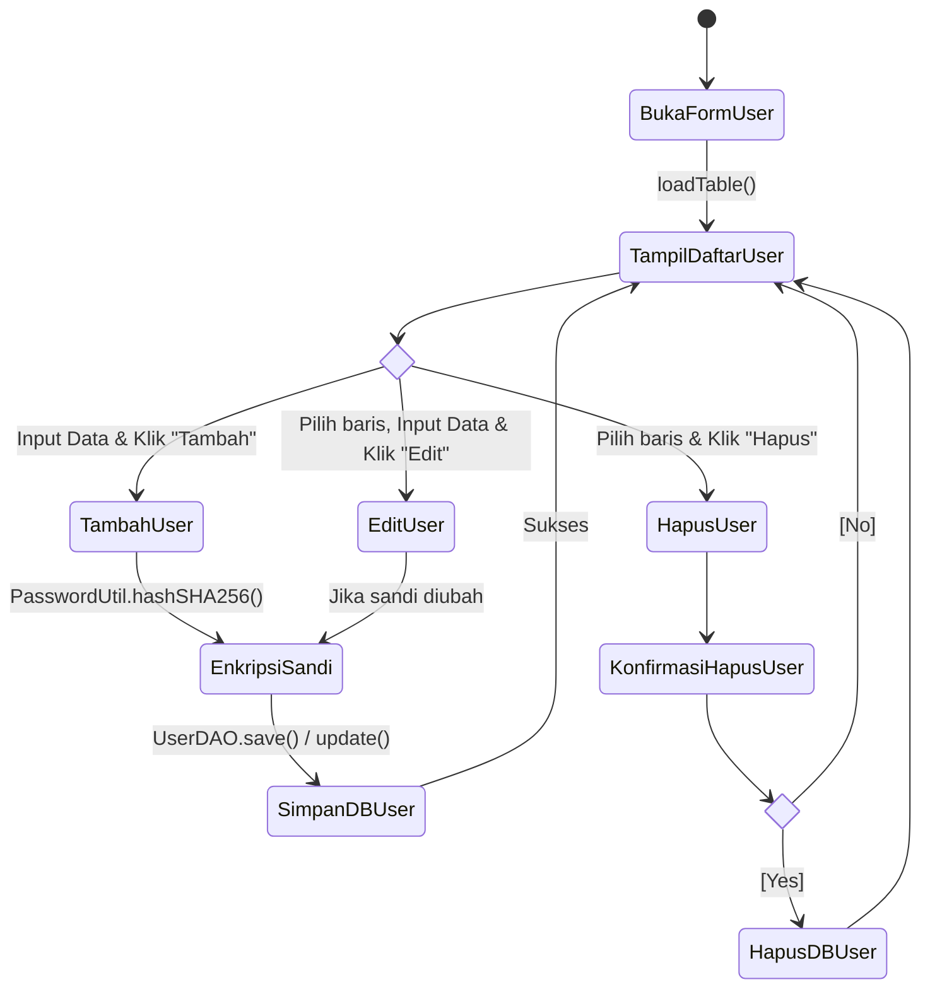
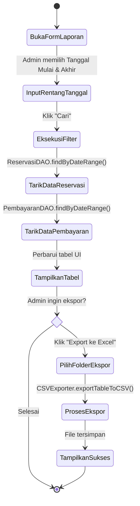
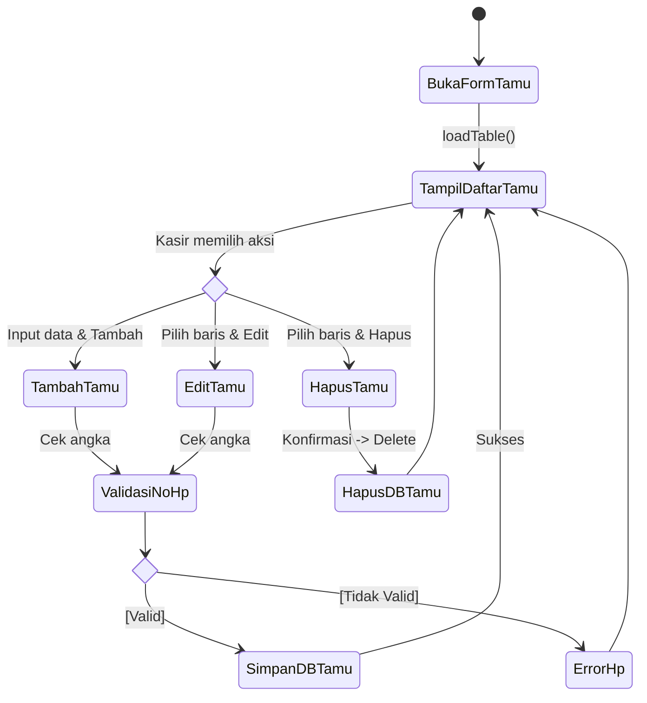
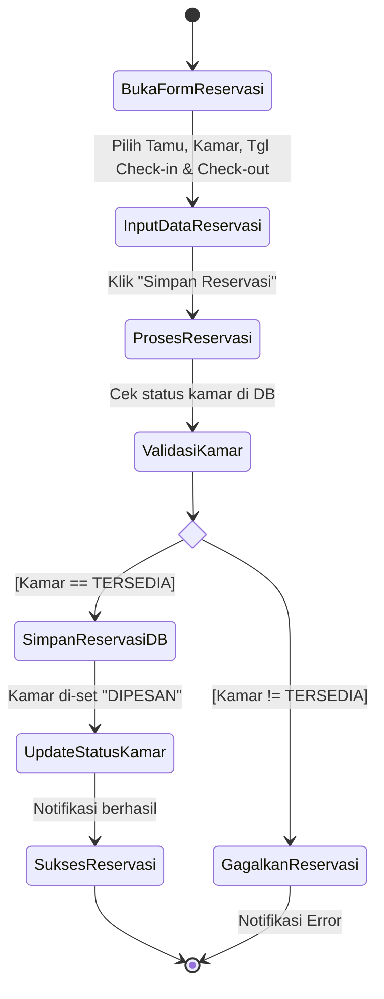
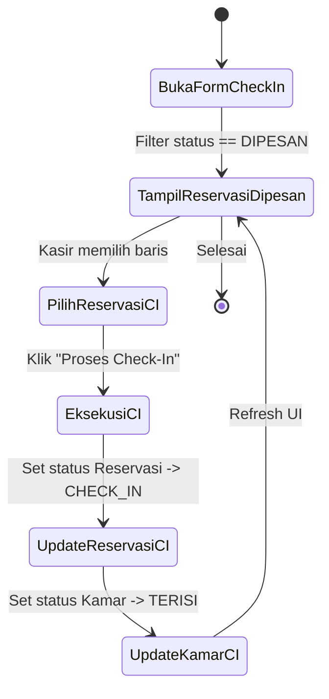
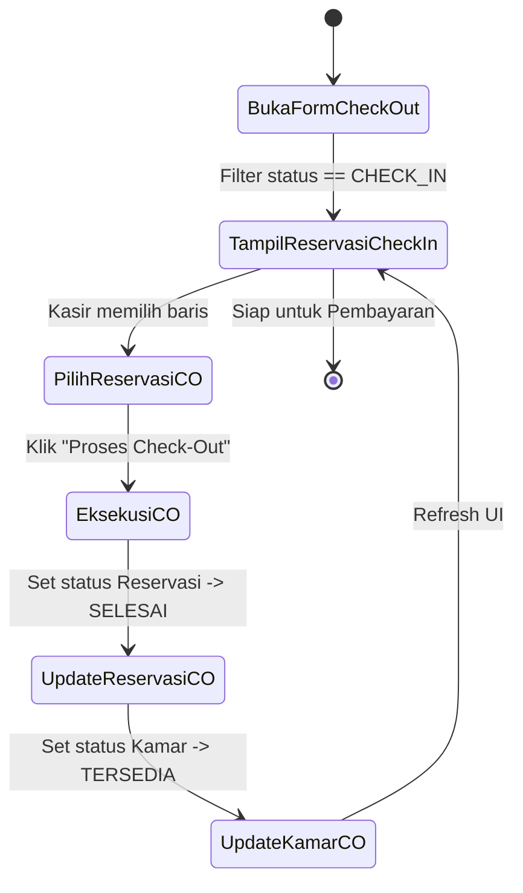
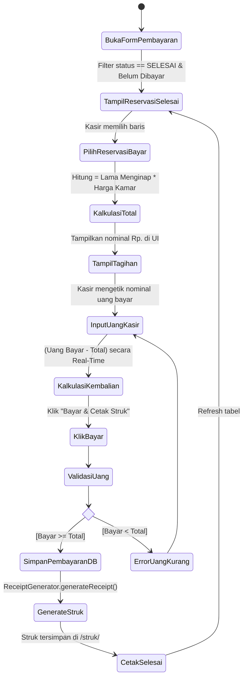

# Kumpulan Activity Diagram Berdasarkan Use Case

Berikut adalah detail Activity Diagram untuk masing-masing sistem (Use Case) yang telah disesuaikan 100% dengan alur *source code* Java pada aplikasi HotelReservation Anda.

## 👨‍💼 Modul Admin

### UC1: Manajemen Kamar
Menjelaskan alur CRUD (Create, Read, Update, Delete) pada form `FormKamar.java`.

### UC2: Manajemen User
Menjelaskan alur penambahan dan pengeditan User beserta enkripsi sandi pada `FormUser.java`.

### UC3 & UC4: Melihat Laporan & Histori Pembayaran
Digabungkan karena keduanya berada dalam satu alur di `FormLaporan.java`.

---

## 👩‍💻 Modul Kasir

### UC5: Kelola Data Tamu
Mirip dengan UC1, mengatur data tamu pada `FormTamu.java`.

### UC6: Reservasi Kamar
Penyewaan kamar baru di `FormReservasi.java` dan divalidasi oleh `ReservasiService.java`.

### UC7: Proses Check-In
Mengganti status saat tamu tiba di hotel (`FormCheckIn.java`).

### UC8: Proses Check-Out
Mengganti status saat tamu meninggalkan kamar (`FormCheckOut.java`).

### UC9: Proses Pembayaran
Menyelesaikan pembayaran dan pembuatan struk (`FormPembayaran.java`).

